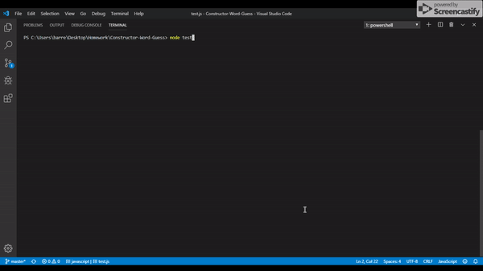

# Constructor-Word-Guess

The constructor word guess game is essentially a hangman game build using node.js. The application relies on a constructor built for the letters that is then passed into the word constructor. From there the app uses inquirer to prompt the user to input a letter and then checks whether the letter is contained in the word. If the guess is correct, the letter is revealed whereas if the guess if incorrect, the application will prompt the user to keep guessing. If all letters have been guessed for the word the application ends.

You can find the link here  https://drive.google.com/file/d/15nCZm0yLzoUIGuw6JBkP7kx32pr_tCi9/view